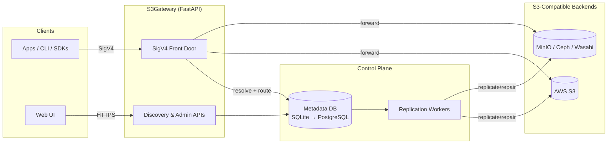

# S3Gateway — Policy‑Aware S3 Gateway with Data Sovereignty

Add data sovereignty, deterministic bucket names, and policy‑driven replication to any S3‑compatible backend — without vendor lock‑in. Open source and self‑hosted.

Quick links: [Getting Started](#getting-started) · [Architecture Overview](docs/ARCHITECTURE_OVERVIEW.md) · [Production Readiness](docs/PRODUCTION_READINESS.md)

An open-source FastAPI + vanilla JS stack for discovering objects across S3-compatible providers, exporting repeatable snapshots, and outlining how a metadata‑aware gateway can front any compliant backend. The focus is zero-trust discovery today plus hashing/replication patterns for a portable S3 control plane tomorrow.

---

## Highlights

- **Credential Isolation** – User-supplied keys never leave the browser; backend usage is stateless.
- **Bucket & Object Insight** – List buckets, drill into files, retrieve version histories, and capture caged JSON snapshots.
- **Snapshot Persistence** – Per-endpoint JSON dumps stored under `backend/snapshots/` with configurable caps.
- **Metadata Viewer** – Review prior discoveries, export JSON, or clean up individual snapshots directly from the UI.
- **Gateway Blueprint** – Docs explain namespace hashing + replication so any S3-compatible backend can sit behind the same endpoint.
- **Docker Native** – Containerized frontend/backend plus dev overrides under `docker/`.

---

## Repository Layout

```
backend/        FastAPI app, config/models/services modules, snapshots storage
frontend/       Static UI (index.html, app.js, metadata-viewer.js, styles, nginx.conf)
docker/         Dockerfiles + compose files (base + dev overrides)
data/providers/ CSV datasets used by helper scripts
scripts/        Analysis & tooling (analyze.py, convert_flat.py, sovereignty_checker.py, etc.)
docs/           Contributor guide, architecture notes, ingest plan, protocol text
examples/       Non-sensitive templates such as credentials.example
Makefile        Wrapper around docker compose commands
LICENSE         GNU GPLv3 terms
```

For coding standards, testing requirements, and security tips see `docs/CONTRIBUTING.md`.

---

## Key Docs

- Architecture (at a glance): `docs/ARCHITECTURE_OVERVIEW.md`
- Production readiness & gaps: `docs/PRODUCTION_READINESS.md`
- Deep dive architecture: `docs/ARCHITECTURE.md`
- Protocol semantics & roadmap: `docs/PROTOCOL.md`, `docs/PLAN.md`, `docs/IMPLEMENTATION_PLAN.md`

---

## Architecture Overview

- **Frontend** — `frontend/index.html` served by Nginx (`frontend/nginx.conf`) renders `app.js` (discovery flow) and `metadata-viewer.js` (snapshot browser). The UI reads `window.APP_CONFIG.apiBaseUrl` when present, falling back to origin.
- **Backend** — `backend/main.py` exposes FastAPI endpoints, delegating to `app/services.py` for S3/boto3 operations and snapshot persistence, keeping models typed via `app/models.py`.
- **Snapshot Storage** — JSON artifacts live under `backend/snapshots/` (git-ignored) with limits controlled by `MAX_SNAPSHOT_BUCKETS`, `MAX_SNAPSHOT_FILES`, and `MAX_FILES_PER_BUCKET` from `app/config.py`.
- **Metadata Layer** — `backend/app/hash_utils.py` contains deterministic bucket hashing logic, while `backend/app/db.py` + `backend/app/proxy_meta.py` expose `/proxy/*` APIs to persist bucket/object metadata in a lightweight SQLite database and seed provider capability data from `data/providers/`.
- **Docs & Research** — Deep dive diagrams sit in `docs/ARCHITECTURE.md`; `docs/PROTOCOL.md` and `docs/PLAN.md` document the gateway roadmap. For a concise overview, see `docs/ARCHITECTURE_OVERVIEW.md`.

### Topology (High Level)



### Compose Topology (Dev)

```mermaid
flowchart TB
    subgraph Host
      U[Developer]
      P8080[localhost:8080]
      P8000[localhost:8000]
    end

    subgraph Docker[bridge network: s3gateway]
      FE[[s3gateway-frontend\nNginx]]
      BE[[s3gateway-backend\nFastAPI]]
    end

    U --> P8080
    U --> P8000
    P8080 -->|80| FE
    P8000 -->|8000| BE
    FE -->|HTTP (depends_on healthy)| BE
```
- **Docs & Research** — Deep dive diagrams sit in `docs/ARCHITECTURE.md`; `docs/PROTOCOL.md` and `docs/PLAN.md` document the gateway roadmap. For a concise overview, see `docs/ARCHITECTURE_OVERVIEW.md`.

---

## Getting Started

### Prerequisites

- Docker + Docker Compose
- Python 3.11+ (for local backend work or tests)
- Node/npm optional (frontend is static; `python -m http.server` works)
- S3-compatible credentials

### Quick Start (Docker)

```bash
# Clone the repo
git clone <repository-url>
cd s3gateway

# Build and launch both services
docker-compose -f docker/docker-compose.yml up -d

# Tail logs
docker-compose -f docker/docker-compose.yml logs -f

# Stop everything
docker-compose -f docker/docker-compose.yml down
```

Dev mode with bind mounts / hot reload:

```bash
docker-compose \
  -f docker/docker-compose.yml \
  -f docker/dev/docker-compose.dev.yml up
# or simply
make dev
```

*(All Makefile targets wrap the compose files under `docker/` — run `make help` for the menu.)*

### Manual Backend Run

```bash
cd backend
python -m venv .venv
source .venv/bin/activate  # Windows: .venv\Scripts\activate
pip install -r requirements.txt
uvicorn main:app --reload
```

### Manual Frontend Run

```bash
cd frontend
python -m http.server 8080
# or
npx http-server -p 8080
# or open index.html directly
```

Visit http://localhost:8080 (UI) and http://localhost:8000/docs (backend Swagger).

---

## Gateway Metadata & SigV4 Front Door (preview)

The backend now ships a partial metadata control plane under the `/proxy` prefix:

- `POST /proxy/buckets` — hash & persist backend bucket names for a tenant (`customer_id`, `logical_name`, `backend_ids[]`).
- `GET /proxy/buckets/{customer_id}/{logical_name}` — retrieve hashed mappings (used to route SigV4 requests).
- `POST /proxy/objects` — register object metadata (etag, residency, replica count, encrypted key reference). Optionally include `targets` to enqueue replication jobs.
- `GET /proxy/objects/{customer_id}/{logical_name}` — list stored metadata across all hashed backends.
- `POST /proxy/credentials` / `GET /proxy/credentials/{access_key}` — register SigV4 access keys for tenants.
- `POST /proxy/jobs` / `GET /proxy/jobs` — manage replication queue entries manually.

Data is stored in `metadata.db` (override via `PROXY_METADATA_DB_PATH`). Provider capabilities from `data/providers/providers_flat.csv` are loaded automatically on startup, giving the gateway a residency-aware lookup table.

All `/proxy/*` endpoints require the admin header `X-Admin-Key: <ADMIN_API_KEY>`.

To process replication jobs, run `python scripts/replication_worker.py` (or `REPLICATION_WORKER_INTERVAL=5 python scripts/replication_worker.py`) and replace the stub handler with real boto3 / storage calls.

### SigV4 Front Door (`/s3/...`)

A minimal SigV4 router is exposed at `/s3/{logical_bucket}/{object_path}` (supports `GET`, `PUT`, `DELETE`, `HEAD`). Requests must be signed using AWS SigV4 and use credentials that were registered via `/proxy/credentials`. The router will:

1. Validate the SigV4 signature.
2. Resolve the hashed backend bucket via `/proxy/buckets` metadata.
3. Forward the request to the configured S3-compatible backend using boto3.

Environment variables (router + replication worker share these):

```
S3_BACKEND_DEFAULT_ID=primary
S3_BACKEND_ENDPOINT=https://minio.local
# or S3_BACKEND_ENDPOINTS=primary=https://minio.local,secondary=https://ceph.local
S3_BACKEND_REGION=us-east-1
S3_BACKEND_ACCESS_KEY=<backend access key>
S3_BACKEND_SECRET_KEY=<backend secret>
TENANT_SECRET_PASSPHRASE=<symmetric key for encrypting tenant secrets>
ADMIN_API_KEY=<value required in X-Admin-Key header for /proxy/* endpoints>
```

(Older `PROXY_ROUTER_*` env vars still work for backward compatibility.)

All metadata/admin APIs require `X-Admin-Key: <ADMIN_API_KEY>` and secrets stored via `/proxy/credentials` are encrypted with `TENANT_SECRET_PASSPHRASE`.

Example flow (using boto3 to sign):

```python
from botocore.auth import SigV4Auth
from botocore.awsrequest import AWSRequest
from botocore.credentials import Credentials
import requests

url = "http://localhost:8000/s3/docs/report.txt"
body = b"hello world"
req = AWSRequest(method="PUT", url=url, data=body, headers={"host": "localhost:8000", "x-amz-content-sha256": hashlib.sha256(body).hexdigest(), "x-amz-date": "..."} )
SigV4Auth(Credentials("<tenant-access>", "<tenant-secret>"), "s3", "us-east-1").add_auth(req)
requests.put(url, data=body, headers=req.headers)

### Demo Stack

To spin up a proof-of-concept including the gateway, metadata DB, and replication worker:

```bash
cd docker/demo
docker-compose -f docker-compose.demo.yml up --build
```

And to run the smoke test (registers a tenant, uploads a file via SigV4, waits for replication):

```bash
python scripts/demo_smoke_test.py \
  --api-base http://localhost:8000 \
  --proxy-base http://localhost:8000 \
  --admin-key demo-admin
```

Environment overrides (S3 endpoints, secrets) can be supplied via env vars as noted above.

### Roadmap & Next Steps

The remaining phases for hardening this gateway are tracked in `docs/IMPLEMENTATION_PLAN.md`. Highlights:

1. **Phase 7 (in progress)** – Secure admin workflows, RBAC, and encrypted credential storage (basic encryption + admin key already implemented).
2. **Phase 8 (this doc)** – Demo-ready deployment & observability (docker-compose demo + smoke test now available).
3. **Phase 9** – Automated end-to-end testing (standing up real backends, UI regression tests).

### Before Using in Production

This repository remains a proof of concept. Prior to any production usage:

- Replace the demo sqlite DB with a managed database (PostgreSQL, etc.) and add migrations.
- Harden secret storage (integrate with a KMS or Vault instead of the simple XOR-based helper).
- Add authentication/authorization for the SigV4 gateway itself (rate limiting, tenant isolation).
- Implement real replication error handling (resume, retries, cross-account credentials).
- Run the smoke test plus your own S3 stress tests against production-like backends.

### Performance & Scalability Considerations

- **SQLite bottleneck** – metadata reads/writes are single-process; concurrent gateway + worker requests will contend.
- **Single worker** – `scripts/replication_worker.py` runs in one process; scaling requires splitting DB + adding job sharding.
- **Gateway throughput** – FastAPI + boto3 proxying is synchronous; for high throughput you’ll need async S3 clients, caching, and multiple instances.
- **Logging/monitoring** – Only basic logging exists; add structured logs + metrics before load testing.
```

---

## Development Workflow

- **Hot Reload** – `make dev` attaches `docker/dev/docker-compose.dev.yml`, mounting `backend/` and `frontend/` for live changes.
- **Logs** – `make logs`, `make logs-backend`, `make logs-frontend`.
- **Shell Access** – `make shell-backend` / `make shell-frontend`.
- **Cleanup** – `make clean` tears down containers + volumes.

Follow PEP 8 in backend modules, camelCase JS, and keep helpers next to the endpoints they support. The shared logger inside `app/services.py` should be reused for backend logging.

---

## Testing

- Python unit tests live under `backend/tests/`. Run them with:

  ```bash
  cd backend
  pytest -q
  ```

- New backend endpoints/helpers should ship with pytest coverage that mocks boto3 clients (invalid creds, pagination, snapshot persistence).
- Manual UI verification checklist:
  - Launch stack (`make up` or dev mode).
  - Hit `http://localhost:8000/health`.
  - Submit valid credentials in the Discover tab.
  - Verify snapshots appear under Metadata Viewer and files are written to `backend/snapshots/`.

---

## Documentation & Research

- `docs/CONTRIBUTING.md` — Repo guidelines, coding style, testing expectations.
- `docs/ARCHITECTURE.md` — Mermaid diagrams for request flows, module responsibilities, and container topology.
- `docs/PLAN.md` — S3 gateway roadmap (hashing, replication, residency).
- `docs/INGEST.md` — Secure ingest process notes (client-side encryption, Ceph flows).
- `docs/PROTOCOL.md` — Protocol narrative and references.
- `examples/credentials.example` — Safe template for sharing non-sensitive configuration.

---

## Security Notes

- Never commit real credentials—`.env` and snapshot directories are ignored; copy `env.example` locally when needed.
- `ALLOWED_ORIGINS`, `MAX_SNAPSHOT_*` settings, and snapshot directories are controlled through env vars defined in `app/config.py`.
- `/proxy/*` endpoints require `ADMIN_API_KEY` via the `X-Admin-Key` header, and tenant secrets stored via `/proxy/credentials` are encrypted using `TENANT_SECRET_PASSPHRASE`.
- Sanitized logs only: bucket names or endpoints should not leak to console except via the shared logger with caution.
- HTTPS termination is expected in production deployments (Docker setup assumes local dev).

---

## Contributing

Contributions are welcome! Open an issue describing the change, follow the tests/docs guidelines above, and share screenshots or CLI output where relevant. Please split backend and frontend refactors unless they must land together.

---

## License

Distributed under the GNU General Public License v3.0 (`LICENSE`). By contributing, you agree that your contributions will be licensed under the same terms.

---

## Acknowledgements

- Thanks to the OSS community for FastAPI, boto3, and rich client/browser tooling that made this stack possible.
