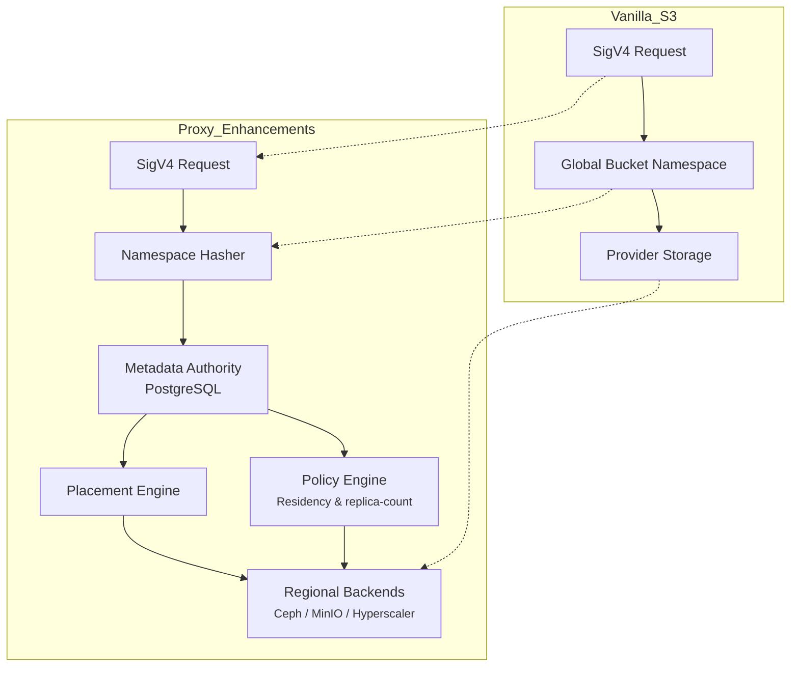
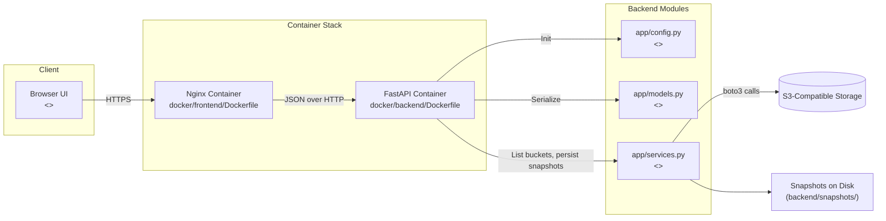
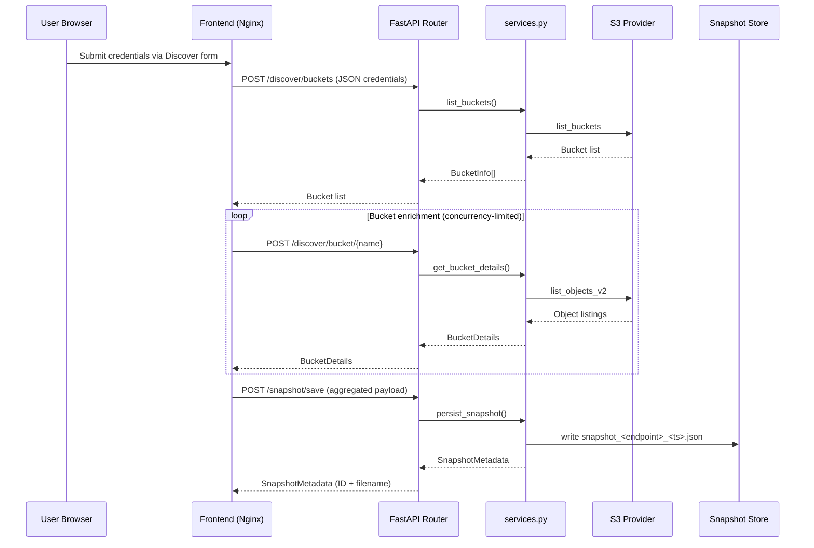
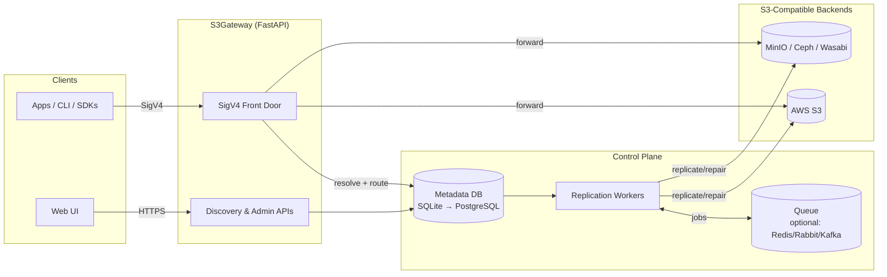
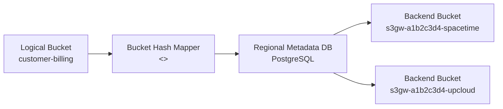
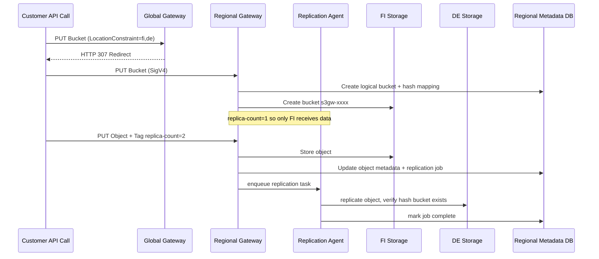
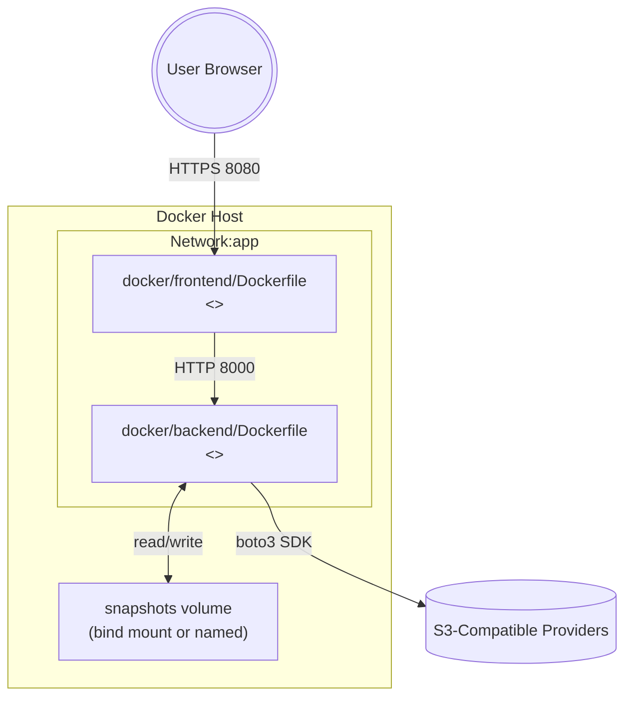

# Architecture Overview

This repository delivers an S3 discovery experience through two lightweight services. A static frontend guides users through credential submission, while a FastAPI backend fans out to provider APIs, aggregates object metadata, and stores capped snapshots for later review. The system favors transparency: every request flow, storage constraint, and compliance control is codified in environment variables and modular Python packages.

## Vanilla S3 vs Proxy Enhancements

The discovery tier adheres to S3 semantics but surfaces policy-aware behaviors that a metadata-driven proxy would implement (namespace hashing, residency-aware placement, replication orchestration).

- **Namespace hashing** replaces the brittle global bucket namespace so multiple tenants can re-use logical names. Deterministic hashes produce `s3gw-<hash>-<provider>` bucket identifiers that are unique per backend and traceable via metadata.
- **Policy metadata** stores replica counts, residency locks, and feature support (object lock, ISO 27001, etc.) alongside each object so the replication agents can enforce compliance in software, not ticket queues.
- **Snapshot awareness** gives operators insight into discovered resources without persisting user credentials, allowing manual review before any replication work begins.

## Component Map

Key points:
- UI logic in `frontend/app.js`/`metadata-viewer.js` relies on `window.APP_CONFIG.apiBaseUrl` and falls back to current origin, so deployments do not hard-code localhost.
- FastAPI is a thin router; services encapsulate boto3 usage and run inside a threadpool to keep the event loop responsive.

## Discovery Data Flow

The metadata viewer repeats the pattern in read-only form by calling `/snapshot/list` and `/snapshot/{id}`. Snapshot deletions invoke `/snapshot/{id}` with `DELETE`.

## Module Responsibilities

- `app/config.py`: centralizes environment-driven settings such as `ALLOWED_ORIGINS`, snapshot directories, and throttling limits. The module ensures `backend/snapshots/` exists on startup.
- `app/models.py`: Pydantic schemas for credentials, S3 responses, and snapshot metadata to guarantee consistent serialization across routes.
- `app/services.py`: synchronous helpers that talk to boto3, sanitize snapshot payloads (`_sanitize_snapshot_buckets`), and handle snapshot persistence, deletion, and listing. These helpers are executed inside `run_in_threadpool` from `main.py`.
- `backend/main.py`: FastAPI router that wires dependencies together, documents snapshot limits at the route level, and exposes health checks.
- Frontend (`frontend/app.js`, `frontend/metadata-viewer.js`): orchestrates credential submission, parallel bucket detail fetching (capped by `BUCKET_DETAILS_CONCURRENCY`), and renders snapshot summaries with sanitized DOM writes. `currentSnapshot.id` is synced with backend metadata so users see consistent identifiers.
- `backend/app/hash_utils.py`: deterministic bucket hashing utilities (ported from the legacy gateway) that the proxy layer and future metadata service can reuse.

## Component Inventory (Repository References)

- `backend/` – FastAPI app, `app/` modules, pytest coverage under `backend/tests/`, and on-disk snapshots. Includes `/proxy/*` metadata API plus the SigV4 router in `app/proxy_router.py`.
- `frontend/` – Static assets (HTML/CSS/JS) and the `nginx.conf` used by the container.
- `docker/` – Container definitions (`docker/backend/Dockerfile`, `docker/frontend/Dockerfile`, and compose files under `docker/` + `docker/dev/`).
- `data/providers/` & `scripts/` – Sovereignty datasets plus helper utilities (`analyze.py`, `convert_flat.py`, `sovereignty_checker.py`, etc.).
- `docs/` – Contributor guide, this architecture narrative, ingest plan, roadmap, protocol text.
- `examples/credentials.example` – Sanitized template for sharing connection details without exposing real keys.
  (Legacy prototypes implemented the namespace hashing + replication agents; new development happens under `backend/` + `scripts/`.)

## Namespace Hashing & Metadata Persistence

### Deployment Topology (Mermaid)

To integrate with the full S3 gateway, customer-facing bucket names are hashed and stored in metadata tables, avoiding collisions across heterogeneous providers.

- Hashing removes the global namespace constraint inherent to AWS S3; different customers can request the same logical name without collision.
- Metadata tables track logical → physical mappings, owners, replica counts, tags, and replication status. The discovery app surfaces this via provider CSVs and snapshot exports.

## Cross-Region Replication & Sync

Replication agents enforce regional availability targets defined by `LocationConstraint` and `replica-count`.

- **Metadata-first**: every object write records authoritative metadata (size, etag, replicas, storage locations) before hitting backends.
- **Deterministic placement**: if `LocationConstraint` lists multiple regions, the replication agent follows the specified order when fulfilling `replica-count`.
- **Health-aware**: when an agent detects backend failure, metadata remains available to reschedule replication toward healthy zones, ensuring each marked region stays consistent with the desired policy.

## Snapshot Storage & Limits

- Snapshots reside in `backend/snapshots/` (ignored by git and Docker builds) as JSON files named `snapshot_<endpoint>_<timestamp>.json`.
- Caps are controlled via environment variables:
  - `MAX_SNAPSHOT_BUCKETS` (default 200)
  - `MAX_SNAPSHOT_FILES` (default 50,000)
  - `MAX_FILES_PER_BUCKET` (default 5,000)
- When truncation occurs, `services.py` logs the reason and still persists the capped payload; downstream tooling should expect partial datasets when limits are reached.
- `ALLOWED_ORIGINS` configures CORS; credentials are never stored server-side and `allow_credentials=False` guards against undesired cookie or token leakage.

## Container & Networking Layout

Deployment tips:
- Bind-mount `backend/snapshots/` (or map to a persistent Docker volume) whenever snapshots must survive container restarts.
- Scale read throughput horizontally by running multiple backend containers behind a load balancer; each worker remains stateless aside from its snapshot directory.
- Rotate credentials via environment variables or secret stores; the backend never persists secrets but relies on the caller to provide them per request.
