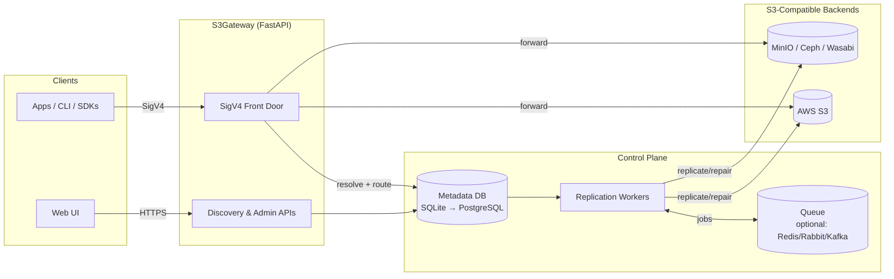

# Architecture (At a Glance)

S3Gateway is a policy‑aware S3 gateway with a metadata control plane. It validates SigV4 requests, resolves deterministic bucket names per tenant, enforces data‑sovereignty and replica policies, and forwards operations to one or more S3‑compatible backends.

## Components
- Web UI: Static frontend for discovery and docs (optional for the gateway itself).
- FastAPI Gateway: SigV4 front door + JSON APIs for discovery and metadata.
- Metadata DB: Stores tenants, hashed buckets, object metadata, and replication jobs. SQLite in the demo; PostgreSQL recommended for production.
- Replication Worker(s): Reads jobs/policies and ensures `replica-count` across allowed regions/providers.
- S3 Backends: Any S3‑compatible endpoint (AWS S3, MinIO, Ceph, Wasabi, etc.).

## Request Flows
- Discovery: Browser submits temporary credentials → FastAPI lists buckets/objects → Sanitized JSON snapshot persisted under `backend/snapshots/` for audit/migration planning.
- Data Path (preview): Client sends SigV4 request to the gateway → Validate signature → Resolve hashed bucket via metadata → Enforce residency/replica policy → Forward to selected backend(s) and record metadata.

## Key Ideas
- Deterministic Hashing: Tenants reuse friendly bucket names; the gateway computes unique hashed names per backend/namespace to avoid collisions and enable isolation.
- Policy‑Driven Placement: Residency and `replica-count` policies are evaluated before data touches storage; workers reconcile drift and heal replicas after failures.
- Compatibility: Stays S3‑compatible on the wire. Multipart uploads, range/conditional requests, and error mapping are part of the completeness roadmap.

## Current Status
- Proof‑of‑concept: SQLite metadata and a partial SigV4 proxy exist; replication workers and Postgres migrations are the next milestones.

See also: `docs/PROTOCOL.md` (semantics) and `docs/PRODUCTION_READINESS.md` (gaps & ops).

## Deployment Topology

