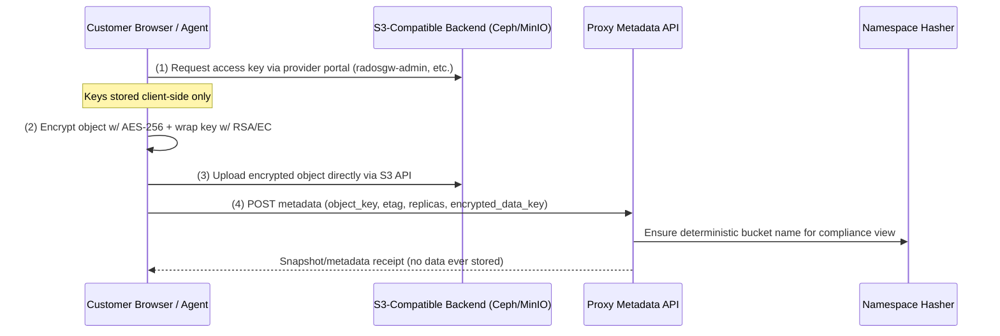

# Secure Ingest Playbook

The ingest flow combines client-side encryption, user-owned credentials, and metadata-only persistence so the proxy never touches plaintext. This document expands the highlights from `README.md`/`docs/ARCHITECTURE.md` with the operational steps teams follow when onboarding a new tenant or ingestion job.

---

## Prerequisites

- **Ceph / MinIO admin tooling** – For Ceph this typically means `radosgw-admin` (installed on the RGW host or via container) to mint per-customer access/secret keys. Other providers may expose similar CLI or API endpoints; keep them handy because the proxy does not mint credentials itself (yet).
- **S3-compatible SDK/CLI** – Whatever the customer uses to upload encrypted data (AWS CLI, s3cmd, custom app).
- **Browser** – For running the discovery UI in this repo if you want a visual verification step.

Documenting these requirements keeps the operational checklist explicit: this repo does **not** bundle `radosgw-admin` or any credential minting UI.

---

## 1. High-Level Flow



Key differences from vanilla S3:

- Clients interact with the actual storage backend themselves; the gateway never proxies payloads.
- The ingest UI from this repo (`frontend/`) only handles discovery + metadata submission, not uploads.
- Namespace hashing ensures the metadata record aligns with the deterministic bucket naming described in `backend/app/hash_utils.py` (originating from the archived `s3gateway/` prototype) and the replication queue.

---

## 2. Detailed Steps

### 2.1 Provision Customer Access (Provider Layer)

1. Operator creates Ceph/MinIO credentials (e.g., using `radosgw-admin user create`).
2. Register the tenant-facing SigV4 keys with the metadata API: `POST /proxy/credentials` (authenticated via `X-Admin-Key: <ADMIN_API_KEY>`) so the proxy can validate signatures, while the raw backend credentials stay in the customer's possession.
   - Secrets are stored encrypted using `TENANT_SECRET_PASSPHRASE`; set this env var before running the backend.
3. Credentials are handed directly to the customer (out-of-band or via the ingest UI with local storage).
4. The proxy never stores backend provider keys. `.env` and `backend/snapshots/` are git-ignored to reinforce this pattern.

### 2.2 Client-Side Encryption (CSE)

- Data is encrypted locally (browser IndexedDB, desktop tool, etc.) using a random AES-256 key.
- The AES key is wrapped with the customer’s RSA/EC public key (envelope encryption).
- The upload bundle consists of `{ ciphertext, encrypted_data_key, metadata }`.

### 2.3 Direct Upload

- The customer uses their credentials to upload encrypted blobs straight to Ceph/other providers.
- No proxy component sits in the data path; traffic goes from customer → provider.

### 2.4 Metadata Registration

- After each upload (or via batch job), the customer POSTs metadata to the proxy service via `/proxy/objects` (or records a discovery snapshot as a stopgap).
- Replication jobs can be enqueued automatically by supplying `targets` in the object request or later via `/proxy/jobs`. The polling worker (`scripts/replication_worker.py`) drains these jobs and pushes data to additional backends.
- Example payload:

```json
{
  "object_key": "customer42/reports/2024-Q4.pdf",
  "version": "v1",
  "backends": {
    "ceph-eu1": { "url": "s3://s3gw-a1b2c3d4-spacetim", "etag": "abc123" }
  },
  "encrypted_key": "base64(aes256-key encrypted with rsa)",
  "key_id": "customer42-k1",
  "key_alg": "rsa-oaep",
  "replica_count": 1,
  "residency": "FI"
}
```

- The metadata service stores:
  - Object pointers + etags
  - Encrypted key material
  - Residency + replica policy
  - Deterministic bucket hashes via the namespace hasher

### 2.5 Optional Snapshot Capture

- The discovery UI (`frontend/app.js`, `metadata-viewer.js`) can capture a sanitized snapshot of the ingest run.
- Snapshots persist to `backend/snapshots/` (capped via `MAX_SNAPSHOT_*` env vars) for audit/reference.

---

## 3. Security Guarantees

| Topic | Enforced By |
|-------|-------------|
| Data privacy | AES-256 encryption + customer-owned RSA/EC wrapping |
| Credential isolation | Keys never leave the customer; backend/`env` files stay local |
| Tenant separation | Provider credentials provisioned per customer (Ceph RGW, etc.) |
| Disaster recovery | Customers can fetch from the provider and decrypt without the proxy |
| Compliance | Residency + replica metadata recorded before replication jobs run |
| Zero-trust | Metadata service stores pointers only; no gateway access to payloads |

---

## 4. Integration with the Repo

- `frontend/` hosts the discover + metadata viewer flows referenced above.
- `backend/` (`app/services.py`) handles snapshot persistence and provides the scaffolding for metadata submissions.
- `docs/ARCHITECTURE.md` explains how ingest metadata feeds the namespace hasher and replication queue housed in the discovery/proxy stack (historical context preserved under `archive/s3gateway/`).
- `data/providers/` and `scripts/` document which EU providers support features like object lock and ISO 27001 — useful when selecting ingest targets.
