# S3 Proxy Plan for Zero-Trust Federated S3 Gateway

## 1. Objectives

* Enable a zero-trust object storage gateway that federates multiple S3-compatible backends
* Enforce client-side encryption (CSE) with client-owned keys
* Maintain an ACID-compliant metadata server for version tracking and policy enforcement
* Allow policy-controlled redundancy, region constraints, and automated healing
* Support onboarding/removal of storage backends dynamically
* Include browser-based import flow for legacy S3 buckets using secure credential handling
* Separate core open-source components from an optional hosted control plane (GitHub/GitLab-style model)

---

## 1.1 Protocol Differences vs Vanilla S3

```mermaid
flowchart LR
    Client["SigV4 Client<br/><small>S3-compatible</small>"]
    Gateway["S3 Proxy Layer<br/><small>backend/main.py</small>"]
    Hasher["Namespace Hasher<br/><small>backend/app/hash_utils.py</small>"]
    Metadata["Metadata Authority<br/>PostgreSQL"]
    Policy["Policy Engine<br/><small>residency + replica-count</small>"]
    Placement["Placement Engine"]
    Backends["Regional Backends<br/><small>Ceph/MinIO/AWS/etc.</small>"]

    Client --> Gateway --> Hasher --> Metadata
    Metadata --> Policy --> Placement
    Placement --> Backends
```

- **Namespace Hashing** – logical buckets are deterministically hashed (`s3gw-<hash>-<provider>`) so tenants can request familiar names without global conflicts. Hashing code now lives in `backend/app/hash_utils.py` and its metadata representations are described in `docs/ARCHITECTURE.md`.
- **Policy Metadata** – metadata rows persist residency (`region_lock`), `replica-count`, encryption tags, and feature support (object lock, ISO 27001). The replication queue reads the policy fields before touching storage.
- **Snapshot & Discovery Tier** – `backend/` + `frontend/` capture sanitized discovery snapshots and never store customer credentials, providing a human-friendly inspection layer before data enters the gateway.
- **Component References** – `docker/` contains the container definitions that orchestrate the discovery tier, while `data/providers/` + `scripts/` catalog EU provider capabilities referenced by the policy engine.

---

## 1.2 Current Repository Implementation

- **Hashing utilities** live in `backend/app/hash_utils.py` with pytest coverage, ensuring deterministic bucket names for any backend identifier.
- **Metadata store** is bootstrapped via `backend/app/db.py`, using a lightweight SQLite database (`metadata.db` by default, overridable via `PROXY_METADATA_DB_PATH`). `data/providers/providers_flat.csv` is seeded on startup to expose residency and capability data.
- **Metadata API** sits under `/proxy/*` (implemented in `backend/app/proxy_meta.py`) with CRUD endpoints for bucket mappings and object metadata.
- **Tests** cover the API helpers directly (`backend/tests/test_proxy_meta.py`).

These building blocks replace the direct dependency on the archived `s3gateway/` tree for new development. Future phases will extend them into the full proxy.

---

## 2. System Components

### 2.1 S3 Proxy Layer (API)

* Accepts `PUT`, `GET`, `HEAD`, `DELETE` requests
* Handles encryption metadata, validates headers
* Performs quorum-based writes to storage backends
* Communicates with metadata server and cache layer

### 2.2 Metadata Server

* ACID-compliant (PostgreSQL or CockroachDB)
* Stores:

  * `object_key`, `version_id`, `tenant_id`
  * Per-backend state (version, checksum, status)
  * Encryption metadata: key ID, key version, encrypted key
  * Redundancy class & region policy mapping
  * Timestamps and audit logs
* Backed by append-only changelog table or WAL for healing

### 2.3 Redis Cache Layer

* TTL-based caching of hot metadata
* Decreases DB load for read path

### 2.4 Storage Backend Registry

* Registry of black-box S3 backends:

  * `storage_id`, `region`, `type` (e.g., Ceph, Wasabi, MinIO)
  * Health status, RTT, read/write throughput
  * Policy flags: residency, SLA, encryption support

### 2.5 Background Workers

* Replica repair daemon (healing jobs). Phase 3 introduces the first polling worker using sqlite-backed replication jobs and a CLI runner under `scripts/replication_worker.py`.
* Storage health pinger (latency, availability)
* Metadata vacuum and snapshot job
* Region placement checker
* Message queue poller for bootstrap replication

### 2.6 Replication Queue & Agents

* Queue stored in PostgreSQL (table-based job queue)
* Each job contains:

  * `object_key`, `source_backend`, `target_backends[]`, `policy_class`, `encryption_required`
* Agents fetch jobs from the queue and:

  * Decrypt credentials (if needed)
  * Fetch object from source
  * Replicate to target S3 backends
  * Update job status and metadata entries
* Agents can be independently deployed or clustered

---

## 3. Encryption Model

### 3.1 Client-Side Encryption (CSE)

* Client encrypts file with random AES-256 key
* AES key encrypted with client-owned RSA/EC public key
* Gateway stores:

  * `ciphertext`
  * `encrypted_data_key`
  * `key_id`, `encryption_alg`, `key_version`
* Gateway cannot decrypt data

### 3.2 Key Rotation (Envelope Model)

* Clients can rotate keys by:

  * Decrypting `data_key` with old key
  * Re-encrypting with new public key
  * Updating metadata only

---

## 4. Quorum and Redundancy Policies

### 4.1 Quorum-Based Writes

* Example: 3-of-5 write policy
* Gateway accepts a PUT only when quorum is reached
* Writes to remaining nodes retried in background

### 4.2 Redundancy Classes

* `StandardClass`: 3 copies across at least 2 regions
* `RegionalClass`: 2 copies within same country
* `ColdArchiveClass`: 2-of-6 erasure coding
* Metadata maps each object to its redundancy class

---

## 5. Region and Compliance Enforcement

* Each backend is tagged with `region`, `jurisdiction`, and `SLA`
* Gateway uses policy engine to:

  * Enforce `region_lock` for compliance (e.g., EU-only)
  * Select backend sets dynamically based on policy
  * Prevent cross-jurisdiction writes

---

## 6. Onboarding New Storage Backends

### 6.1 Add Storage Flow

* Admin registers backend via `/admin/add-storage`

  * Metadata: endpoint URL, credentials, region, type, SLA
* Health check run
* Policy mapping updated (can this backend be used for tenant X?)
* Added to active backend pool

### 6.2 Backend Health Monitoring

* Gateway tracks latency and availability
* Unhealthy backends excluded from writes, reads
* Recovery triggered once backend returns to healthy

---

## 7. Security Architecture

### 7.1 Zero Trust Design

* Gateways and backends are mutually untrusted
* Authentication and authorization via signed requests / OAuth2
* Client metadata never trusts gateway to decrypt

### 7.2 Audit Logging

* All metadata changes logged with timestamps
* Gateway logs object access per tenant
* Append-only logs stored separately in encrypted archive

---

## 8. Deployment Architecture

* Gateways: Stateless, horizontal scaling
* Metadata server: PostgreSQL or CockroachDB (HA, replicated)
* Redis: Clustered cache
* Workers: Async task queues for healing, logs, metrics
* Replication agents: Poll message queue in DB, scalable

---

## 9. API Design (Simplified)

### PUT /objects

* Headers:

  * `X-Encrypted-Key`, `X-Key-Id`, `X-Key-Version`, `X-Encryption-Alg`
  * `X-Redundancy-Class`
* Body: Encrypted object blob

### GET /objects

* Returns encrypted blob + headers

### POST /admin/add-storage

* Add new S3-compatible backend

---

## 10. Bootstrap Import Support

### 10.1 Browser-Based Source Key Encryption

* Users input AWS or source S3 keys in web UI
* Keys encrypted in-browser using WebCrypto API with user passphrase
* Encrypted key blob stored in metadata DB
* Only decryptable client-side with passphrase

### 10.2 Import UI Flow

* Prompt: Add source S3 buckets (URL + keys + region)
* Prompt: Define replication policy (target regions, redundancy)
* Add proxy-managed destination S3 backends (or select from approved list)
* User provides decryption passphrase to start job
* Replication agent fetches from DB queue
* Agent decrypts key, transfers data, updates status
* Progress shown in dashboard, cluster marked GREEN when replication matches policy
* Source backends can be marked for deletion post-migration

---

## 11. Hosted Control Plane (Optional)

* Centralized SaaS control plane for managing:

  * Gateway deployments
  * Metadata dashboards and replication metrics
  * Storage backend registry and SLA enforcement
  * Policy editor for jurisdiction, redundancy, encryption
  * Multi-tenant access control and credential broker
  * Compliance logs and billing dashboard
* Similar to GitHub/GitLab model:

  * Core open source protocol and tooling
  * Hosted value-added UI + orchestration layer available under commercial offering

---

## 12. Next Steps

1. Define metadata schema in PostgreSQL
2. Implement gateway prototype (FastAPI or Go)
3. Build Redis + DB interaction layer
4. Create CLI test client for CSE-encrypted uploads
5. Define policy DSL for region + redundancy rules
6. Deploy 3 backends (MinIO, Ceph, Wasabi) for initial testing
7. Build self-hosted Bootstrap UI for import and credential handling
8. Implement DB-backed message queue and replication agent executor
9. Define hosted control plane architecture and SaaS roadmap
