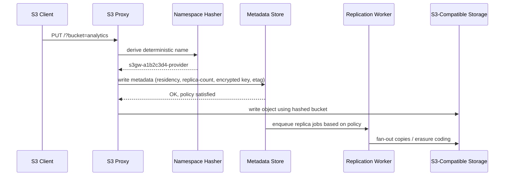

# S3 Proxy Protocol (Draft)

This living document describes the partial protocol implemented (and planned) by this repository: a credential-isolated discovery tier backed by a metadata service that can front any S3-compatible backend. It keeps the useful pieces—namespace hashing, residency-aware replication, and snapshot persistence—without assuming any proprietary control plane.

---

## Goals

1. **Work with any S3-compatible storage** (AWS, MinIO, Ceph, Wasabi, etc.).
2. **Never store customer credentials** – discovery happens client-side, metadata is sanitized.
3. **Use deterministic namespace hashing** so tenants can reuse friendly bucket names without collisions.
4. **Record residency + replica policy** before objects touch storage; metadata drives replication.
5. **Stay modular** – the proxy + metadata layer should drop into existing deployments or stand alone.

---

## High-Level Flow

```mermaid
flowchart LR
    Browser["Discovery UI<br/><small>frontend/</small>"]
    API["Snapshot Service<br/><small>backend/</small>"]
    Proxy["S3 Proxy / Metadata Layer<br/><small>future component</small>"]
    Hasher["Namespace Hasher"]
    Meta["Metadata Store<br/>PostgreSQL"]
    Policy["Residency + Replica Policy"]
    Worker["Replication / Placement Agents"]
    Storage["S3-Compatible Backends"]

    Browser -->|"Credentials stay local"| API
    API -->|"Sanitized snapshots"| Proxy
    Proxy --> Hasher --> Meta
    Meta --> Policy --> Worker --> Storage
    Proxy -->|"Read-through"| Storage
```

- `frontend/` + `backend/` (this repo) capture discovery data and persist JSON snapshots under `backend/snapshots/`.
- The future proxy reuses these insights to hash bucket names, look up residency requirements, and select a backend.
- Replication agents consume metadata rows to enforce `replica-count` across EU providers or other S3-compatible targets.

---

## Namespace Hashing & Replication

- Hashing ensures the proxy can reconcile any logical bucket name with the provider-specific namespace.
- Metadata rows store `object_key`, `hashed_bucket`, `region_lock`, `replica_count`, and encrypted key material.
- Replication workers read from the metadata store (`backend/app/db.py`) and fulfil policy requirements (e.g., “keep 2 copies in Finland + Germany”) via the sqlite-backed job queue processed by `backend/app/replication.py` / `scripts/replication_worker.py`.

---

## Repository Component Mapping

- `frontend/` – Discovery UI (credential form, bucket explorer, metadata viewer).
- `backend/` – FastAPI service (`app/services.py`) for S3 fan-out, snapshot persistence, and new pytest coverage under `backend/tests/`.
- `docker/` – Container definitions for the UI/API plus dev overrides.
- `data/providers/` + `scripts/` – EU provider catalogs and helper utilities (analyze, convert, sovereignty checker) that feed the policy engine.
- `docs/ARCHITECTURE.md`, `docs/PLAN.md`, `docs/INGEST.md` – Architecture diagrams, roadmap, and ingest playbook referenced by this protocol.
- `archive/s3gateway/` – Legacy automation that inspired the proxy layer (hashing, placement, replication). New work now targets `backend/` + `scripts/`.

---

## User & Key Management / Proxy Endpoint

**Credential provisioning.** Today, customer keys are minted through provider tooling (e.g., `radosgw-admin user create`). There is no UI in this repo to manage users or rotate secrets; operators must rely on existing storage-admin tools and then hand credentials directly to tenants.

**Proxy metadata API.** Register tenant access keys via `POST /proxy/credentials` (requires `ADMIN_API_KEY` header) so the SigV4 router can validate signatures. Secrets are encrypted in SQLite using `TENANT_SECRET_PASSPHRASE`.

- Tenant details + hashed buckets
- Uploaded public keys (for envelope encryption)
- Residency / replica policies

Until that exists, the discovery UI simply helps visualize what the customer sees once credentials are injected into the browser form.

**Proxy endpoint publishing.** The S3 proxy exposes a SigV4-compatible endpoint (e.g., `https://proxy.example.com`). Each request:

1. Authenticates using the customer’s access/secret key (looked up in the local metadata DB).
2. Resolves the deterministic hashed bucket name via the namespace hasher.
3. Reads residency + replica policy for that tenant.
4. Forwards the request to the selected backend(s), applying replication logic where needed.

Only after the local metadata lookup succeeds does the proxy forward the payload to the S3 backends, ensuring policy checks occur before data leaves the proxy.

---

## Status

This protocol is intentionally partial:

- ✅ Discovery UI & snapshot API (this repo)
- ✅ Documentation + data sources for hashing/residency planning
- 🕒 Proxy, metadata service, and replication agents (tracked in `docs/PLAN.md`)

Contributions are welcome—start by improving the discovery stack, then help implement the proxy pieces outlined above.
