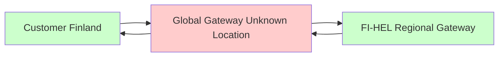
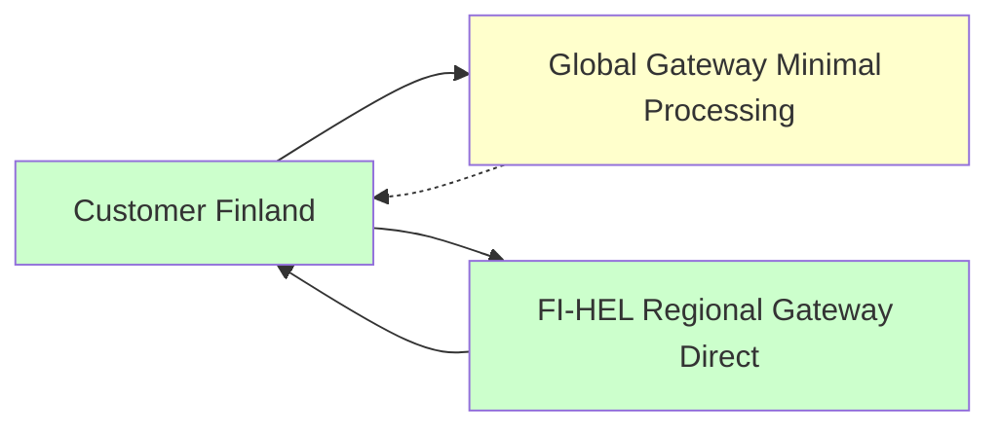

# GDPR Compliance: Proxy vs Redirect Architecture

## 🚨 The GDPR Problem with Proxying

Your question about **customer access URL rewriting vs redirecting** identified a **critical GDPR compliance issue** in the original two-layer architecture.

### ❌ Problematic: Proxy Architecture



**GDPR Violations:**
- Customer data processed in unknown jurisdiction
- IP addresses logged globally (GDPR Article 4(1) - personal data)
- Request content visible to global gateway
- Audit trail contaminated with cross-border data

### ✅ Compliant: Redirect Architecture



**GDPR Compliance:**
- No customer data processed globally
- Direct customer-to-region connection
- Complete audit trail in correct jurisdiction

## 📋 Detailed Comparison

| Aspect | Proxy Approach ❌ | Redirect Approach ✅ |
|--------|-------------------|---------------------|
| **Data Flow** | Customer → Global → Regional → Global → Customer | Customer → Global (redirect) → Regional (direct) |
| **Customer Data Exposure** | Global gateway sees all data | Global gateway sees only routing info |
| **IP Address Logging** | Logged globally (GDPR violation) | Logged only regionally |
| **Request Content** | Visible to global gateway | Never seen by global gateway |
| **Audit Trail** | Mixed jurisdictions | Clean regional trails |
| **GDPR Article 44** | Violates (unauthorized transfer) | Complies (no transfer) |
| **S3 Client Impact** | Transparent | Transparent (follows redirects) |

## 🔧 Technical Implementation

### HTTP 307 Redirects (GDPR Compliant)

```python
# Global Gateway - GDPR Compliant
@app.middleware("http")
async def gdpr_routing_middleware(request: Request, call_next):
    customer_id = request.headers.get('X-Customer-ID', 'demo-customer')
    target_region = router_service.get_customer_region(customer_id)
    
    if request.url.path.startswith('/s3/'):
        # Log MINIMAL routing decision (no customer data)
        router_service.log_routing_decision(customer_id, target_region, 'customer_region', request)
        
        # Return HTTP redirect - customer goes directly to regional endpoint
        redirect_url = f"{regional_endpoint}{request.url.path}"
        return RedirectResponse(url=redirect_url, status_code=307)
```

### Database Schemas

#### Global Database (GDPR Compliant)
```sql
-- MINIMAL routing log - NO personal data
CREATE TABLE routing_log (
    id SERIAL PRIMARY KEY,
    customer_id VARCHAR(100),           -- Just ID for routing
    routed_to_region VARCHAR(50),       -- Operational info
    routing_reason VARCHAR(100),        -- Operational info
    created_at TIMESTAMP DEFAULT CURRENT_TIMESTAMP
    -- REMOVED for GDPR compliance:
    -- source_ip, user_agent, request_content, request_headers
);
```

#### Regional Database (Complete Data)
```sql
-- COMPLETE operations log - ALL customer data in correct jurisdiction
CREATE TABLE operations_log (
    customer_id VARCHAR(100),
    source_ip INET,                     -- OK - in correct jurisdiction
    user_agent VARCHAR(255),            -- OK - in correct jurisdiction
    request_content TEXT,               -- OK - in correct jurisdiction
    compliance_info JSONB,              -- Complete compliance tracking
    created_at TIMESTAMP DEFAULT CURRENT_TIMESTAMP
);
```

## 🚀 Deployment

### GDPR-Compliant Architecture

```bash
# Deploy GDPR-compliant version
docker-compose -f docker-compose.gdpr-compliant.yml up -d

# Test compliance
./demo-gdpr-compliance.sh
```

### Test HTTP Redirects

```bash
# Should return HTTP 307 redirect
curl -v -H "X-Customer-ID: finnish-customer" http://localhost:8000/s3/test-bucket

# Expected response:
# HTTP/1.1 307 Temporary Redirect
# Location: http://localhost:8001/s3/test-bucket
# X-GDPR-Redirect: true
# X-Target-Region: FI-HEL
```

## 📊 Audit Trail Comparison

### ❌ Proxy Approach (GDPR Problematic)

**Global Gateway Log:**
```json
{
  "customer_id": "finnish-customer-123",
  "source_ip": "192.168.1.100",          ← GDPR violation
  "user_agent": "aws-cli/2.0.1",         ← GDPR violation
  "request_path": "/s3/sensitive-data/personal.pdf",  ← GDPR violation
  "request_headers": {...},              ← GDPR violation
  "timestamp": "2024-01-01T10:00:00Z"
}
```

**Regional Gateway Log:**
```json
{
  "customer_id": "finnish-customer-123",
  "source_ip": "10.0.0.1",              ← Internal proxy IP (not real customer)
  "proxied_from": "global-gateway",      ← Indicates proxying
  "compliance_info": {
    "cross_border_transfer": true,        ← GDPR violation
    "data_processed_globally": true       ← GDPR violation
  }
}
```

### ✅ Redirect Approach (GDPR Compliant)

**Global Gateway Log (Minimal):**
```json
{
  "customer_id": "finnish-customer-123",  ← Just for routing
  "routed_to_region": "FI-HEL",          ← Operational info
  "routing_reason": "customer_region",    ← Operational info
  "timestamp": "2024-01-01T10:00:00Z"
  // NO IP addresses, user agents, request content, or personal data
}
```

**Regional Gateway Log (Complete):**
```json
{
  "customer_id": "finnish-customer-123",
  "source_ip": "192.168.1.100",          ← Real customer IP - OK in FI jurisdiction
  "user_agent": "aws-cli/2.0.1",         ← OK in FI jurisdiction
  "operation": "GetObject",
  "compliance_info": {
    "region_processed": "FI-HEL",
    "jurisdiction": "Finland",
    "gdpr_redirect": true,                ← Compliant redirect
    "cross_border_transfer": false,      ← GDPR compliant
    "direct_regional_access": true       ← Customer connected directly
  }
}
```

## ⚖️ Legal Compliance

### GDPR Articles Addressed

| Article | Requirement | Proxy Compliance | Redirect Compliance |
|---------|-------------|------------------|-------------------|
| **Article 4(1)** | Personal data definition | ❌ IP logged globally | ✅ IP logged regionally |
| **Article 5(1)(c)** | Data minimization | ❌ Excessive global data | ✅ Minimal global data |
| **Article 25** | Data protection by design | ❌ Architecture allows violations | ✅ Architecture prevents violations |
| **Article 30** | Records of processing | ❌ Mixed jurisdiction records | ✅ Clean regional records |
| **Article 44** | International transfers | ❌ Unauthorized transfers | ✅ No transfers |

### Compliance Benefits

1. **Data Minimization (Article 5)**: Global gateway processes only routing info
2. **Purpose Limitation (Article 5)**: Customer data used only for intended S3 operations
3. **Storage Limitation (Article 5)**: Complete data stored only in correct jurisdiction
4. **Accountability (Article 5)**: Clear audit trails show compliance measures
5. **Data Protection by Design (Article 25)**: Architecture prevents violations

## 🛡️ Security & Privacy

### Client Behavior

**S3 Clients automatically follow HTTP 307 redirects:**
- AWS CLI: Follows redirects transparently
- boto3: Handles redirects automatically
- Browser: Redirects to regional endpoint
- curl: Follows with `-L` flag

### Regional Isolation

```bash
# Finnish customer data verification
docker exec s3gateway_postgres_fi_hel_gdpr psql -U s3gateway -d s3gateway_regional \
  -c "SELECT customer_id, region_id, compliance_requirements FROM customers WHERE customer_id = 'finnish-customer';"

# Global database verification (should be minimal)
docker exec s3gateway_postgres_global_gdpr psql -U s3gateway -d s3gateway_global \
  -c "SELECT customer_id, primary_region_id FROM customer_routing WHERE customer_id = 'finnish-customer';"
```

## 🎯 Implementation Guide

### 1. Update Environment Variables

```yaml
# docker-compose.gdpr-compliant.yml
environment:
  ENABLE_GDPR_REDIRECTS: "true"  # Enable compliant redirects
  REGIONAL_ENDPOINTS: '{"FI-HEL": "http://localhost:8001", "DE-FRA": "http://localhost:8002"}'
```

### 2. Use GDPR-Compliant Schema

```bash
# Global database uses minimal schema
./code/gateway/schema_global_gdpr.sql

# Regional databases use complete schema  
./code/gateway/schema_regional.sql
```

### 3. Deploy and Test

```bash
# Deploy GDPR-compliant architecture
docker-compose -f docker-compose.gdpr-compliant.yml up -d

# Run compliance demonstration
./demo-gdpr-compliance.sh

# Verify redirect behavior
curl -v -H "X-Customer-ID: test-customer" http://localhost:8000/s3/test-bucket
```

## 📈 Operational Benefits

### Performance
- **Reduced latency**: Direct customer-to-region connections
- **No proxy overhead**: Eliminates global gateway processing
- **Scalable**: Add regions without affecting existing ones

### Compliance
- **Audit ready**: Clean jurisdictional separation
- **Data sovereignty**: Automatic compliance with local laws
- **Privacy by design**: Architecture prevents violations

### Operations
- **Clear responsibility**: Each region owns its data
- **Simplified debugging**: Single-jurisdiction audit trails
- **Regulatory alignment**: Matches data protection authority boundaries

## 🎉 Conclusion

The **HTTP redirect approach** solves the GDPR compliance problem by ensuring:

1. **Zero customer data processing** in the global gateway
2. **Direct customer connections** to regional endpoints
3. **Complete jurisdictional isolation** of personal data
4. **Transparent operation** for S3 clients

This architecture transformation turns a potential GDPR violation into a **compliance-by-design** solution that can withstand regulatory scrutiny while maintaining operational efficiency.

Your question about URL rewriting vs redirecting identified a critical compliance gap - thank you for raising this important point! 🛡️ 